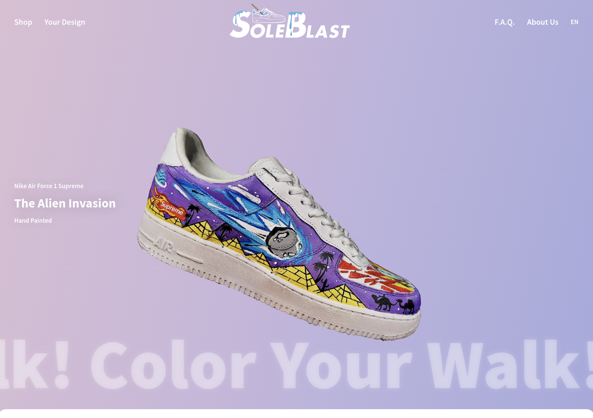

# Project Name

[](https://production--soleblast.netlify.app) 
[](./LICENSE)
[](https://vuejs.org/)

## Project Overview

This website was originally created as a personal project and a potential business venture. The goal was to build a brand where people could purchase custom-painted shoes, in collaboration with a talented artist. Unfortunately, the project could not continue due to communication challenges with the artist, but the experience was incredibly valuable.

As my first-ever website, I’m proud of what I achieved. I learned a lot during the process, including how to write and deploy the entire codebase, design the UI/UX, and create all the SVG elements used on the site. I handled the full-stack development, implementing both the frontend and backend, including integrating payment features through agreements with local Greek banks and securing the site with HTTPS and SSL certificates.

The project remains live today, and though it didn’t turn into a long-term business, it was an extremely rewarding experience that expanded my technical skills and introduced me to web hosting, deployment, and managing real-world payments.

## Demo

Here’s a quick look at the live version: [Live Demo](https://production--soleblast.netlify.app)

## Screenshots

### Homepage


## Tech Stack

- **Vue.js 3** - Progressive JavaScript Framework
- **Vue Router** - Router for Vue.js applications
- **Vuex** - State management pattern
- **Tailwind CSS** - For styling
- **Firebase** - For hosting the database
- **Netlify** - For the hosting and for lambda functions (email service)

## Prerequisites

Before you begin, ensure you have met the following requirements:

- **Node.js** (version >= 14.x)
- **npm** or **yarn**

## Setup and Installation

To get started with the project locally, follow these steps:

### 1. Clone the repository

```bash
git clone https://github.com/mbastakis/sole-blast.git
```

### 2. Navigate to the project directory

```bash
cd sole-blast
```

### 3. Install dependencies
Using npm:

```bash
npm install
#Or using yarn:
yarn install
```

### 4. Create environment variables
Create a .env file in the root directory and configure the necessary environment variables. Here’s an example .env file:
```bash
VUE_APP_API_URL=https://api.example.com
VUE_APP_FEATURE_TOGGLE=true
```

### 5. Running the development server
To run the project in development mode, use the following command:

```bash

npm run serve
# Or if using yarn:
yarn serve
```
Your Vue.js application should now be running at http://localhost:8080.

Build and Deployment
To build the project for production, run:
```bash
npm run build
#Or if using yarn:
yarn build
```

The production-ready files will be in the /dist directory. You can deploy them to any static hosting service like Netlify, Vercel, or your preferred platform.

## License
This project is licensed under the MIT License.

## Acknowledgments
- Vue.js Documentation
- Vue Router
- Vuex